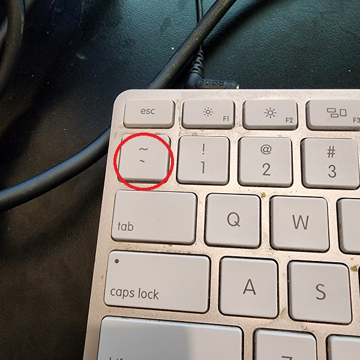
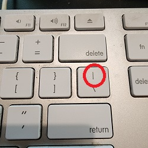

# Writing Good Documentation

## Step 1 - Using Codeblocks.

Codeblocks in markdown make it *very easy* for tech people to **copy, paste, share** code.
A good _Cloud Engineer_ uses Codeblocks whenever possible.

Because it allows others to copy and paste their code to replicate or research issues.


- In order to create codeblocks in markdown you need to use three backticks (`)
- Not to be confused with quotation (')
```
# Get user input for their name
print "Enter your name: "
user_name = gets.chomp

# Print a personalized greeting
puts "Hello, #{user_name}! Welcome to the Ruby world."
```

- When you can you should attempt to apply syntax highlighting to your codeblocks

  ```ruby
  # Get user input for their name
  print "Enter your name: "
  user_name = gets.chomp

  # Print a personalized greeting
  puts "Hello, #{user_name}! Welcome to the Ruby world."
  ```

- Make note of where the backtick character is located.
- It should appear above the tab key,
- but it may vary based on your keyboard layout.



Good Cloud Engineers use codeblocks for both code and errors that appear in the console.

```bash
NameError: undefined local variable or method `undefined_variable' for main:Object
```
> Here is an example of using a codeblock for an error that appears in bash.

When you can always provide a codeblock instead of a screenshot.
If you need to take a scrrenshot make sure it is not a photo from your phone.

> There are certain cases where its okay to take photos with your phone. This is when you are showing something like a keyboard, which does not appear on a computer screen. If it render on your computer screen it should be a screenshot.

## Step 2 - How to take screenshots

A screenshot is when you capture a part of you screen from your laptop, desktop or phone.

This is not be confused with take a photo with your phone.  **Don't do this**

This is what a screenshot from your computer should look like

**Do Like This**


Sure, here are the hotkeys for taking screenshots on both Mac and Windows:

### Mac:

1. **Capture the entire screen:**
   - Press `Command (⌘) + Shift + 3`.

2. **Capture a selected portion of the screen:**
   - Press `Command (⌘) + Shift + 4`, then drag to select the area you want to capture.

3. **Capture a specific window:**
   - Press `Command (⌘) + Shift + 4`, then press `Spacebar`, and click on the window you want to capture.

### Windows:

1. **Capture the entire screen:**
   - Press `PrtScn` (Print Screen) to capture the entire screen.
   - Press `Alt + PrtScn` to capture only the active window.

2. **Capture a selected portion of the screen (Windows 10 and later):**
   - Press `Shift + Windows Key + S` to open the Snipping Tool, then select the area you want to capture.

3. **Capture a selected portion of the screen (Windows 10 and later using Snip & Sketch):**
   - Press `Windows Key + Shift + S` to open Snip & Sketch, then select the area you want to capture.

4. **Capture a selected portion of the screen (Windows 11 using Snip & Sketch):**
   - Press `Shift + S` to open Snip & Sketch, then select the area you want to capture.

These are the basic hotkeys, and the actual functionality might vary slightly depending on your specific operating system version.

## Step 3 - Use Github Flavoured Markdown Task Lists
Github extends Markdown to have a list where you can check off items.[<sup>[1]<sup/>](#external-references)
- [x] Finish Step 1
- [ ] Finish Step 2
- [x] Finish Step 3

# Step 4 - Use Emoji  (Optional)

Github Flavored Markdown (GFM) supports emoji shortcodes.
Here are some examples:

| Name | Shortcode | Emoji |
| --- | --- | --- |
| Clouds | `:cloud:` | :cloud: |
| Clouds | `:cloud_with_lightning:` | :cloud_with_lightning: |


# Step 5 - How to create a Table

You can use the following markdown (md) format to create tables:

```markdown

| Name | Shortcode | Emoji |
| --- | --- | --- |
| Clouds | `:cloud:` | ☁️ |
| Clouds | `:cloud_with_lightning:` | 🌩️ |
```
:cloud:

Github extends the functionality of Markdown tables to provide more alignment and table cell formatting options.  [<sup>[2]</sup>](#external-references)
- Make note of where the pipe character is located.
- It should appear above the Return or Enter key,
- but it may vary based on your keyboard layout.



[Secret Window Hidden Gardern](secret-window/hidden-garden.md)
## External References

- [Github Flavored Markdown Spec](https://github.github.com/gfm/)
- [Basic writing and formatting syntax (Github Flavored Markdown)](https://docs.github.com/en/get-started/writing-on-github/getting-started-with-writing-and-formatting-on-github/basic-writing-and-formatting-syntax)
- [GFM - Tasks Lists](https://docs.github.com/en/get-started/writing-on-github/getting-started-with-writing-and-formatting-on-github/basic-writing-and-formatting-syntax#task-lists) <sup>[1]<sup/>
- [GFM - Emoji CheatSheet](https://github.com/ikatyang/emoji-cheat-sheet)
- [GFM - Tables (with extensions)](https://github.github.com/gfm/#tables-extension-)<sup>[2]<sup/>
